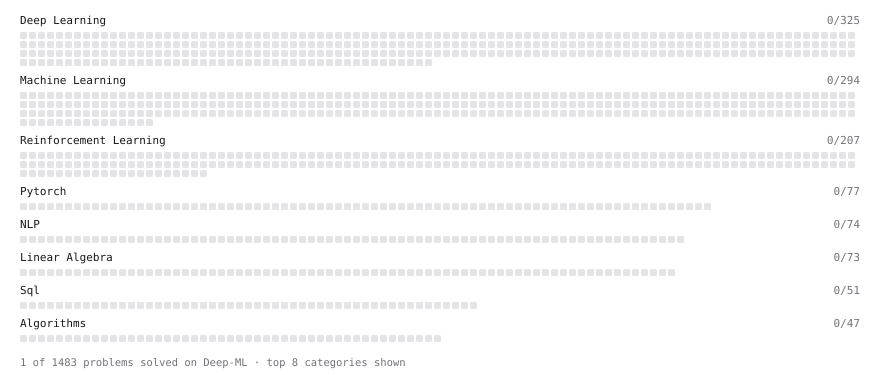

# Deep-ML

My machine learning practice from [Deep-ML](https://www.deep-ml.com). Every solution here was written by hand.

**2** solved · 2 problems · 0 labs · 0 math

[**Browse the interactive portfolio**](https://Nacoor.github.io/deep-ml/) to replay this filling in over time.

## Problems

| | Difficulty | Solved | |
| --- | --- | --- | --- |
| [Chain Rule for Composite Functions](https://www.deep-ml.com/problems/214) | medium | 2026-10-01 | [solution](problems/0214-chain-rule-for-composite-functions) |
| [Jacobian Matrix Calculation](https://www.deep-ml.com/problems/202) | medium | 2026-10-01 | [solution](problems/0202-jacobian-matrix-calculation) |

---

_This file is regenerated by Deep-ML on every push._
